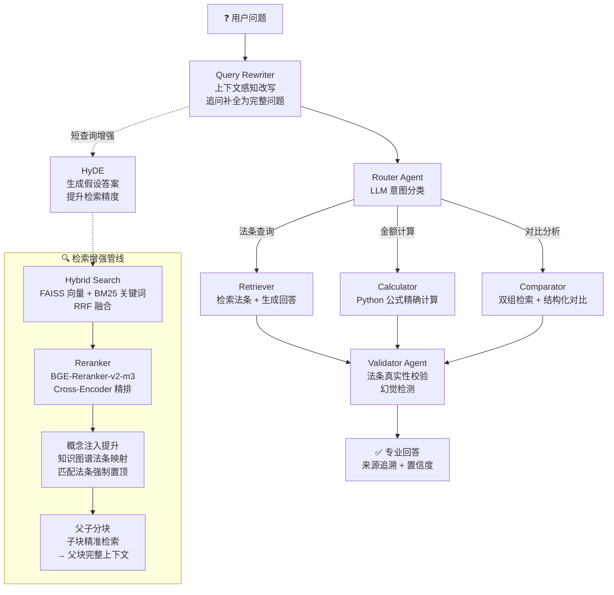

# LaborRAG · 劳动法智能问答系统

> **Agentic RAG × 多 Agent 协作 × 三元组评估**  
> 面向劳动法领域的智能问答系统——输入劳动法问题，自动检索法条、生成专业回答，支持金额计算、法条对比、多轮追问。

---

## 📸 系统截图

### 💬 智能问答

*Agentic RAG 工作流：Router 意图分类 → 检索增强 → 生成回答 → Validator 验证，来源追溯 + CRAG 步骤可视化*

### 📊 三元组评估

*20 题 Golden Set 评估：RAGAS 指标（忠实度 92%）+ 检索指标（P@1=90%, R@5=92.5%）+ 响应指标*

### 📚 知识库管理

*17 部劳动法文档、1243 个法条 chunk，支持上传、构建、法条结构化切分*

---

## 🎯 核心亮点

- **检索精度 P@1**：20% → **90%**（概念注入提升策略：知识图谱法条映射 + 强制置顶）
- **幻觉率**：61% → **8%**（CRAG 自我纠错 + Validator 法条真实性验证 + 答案护栏）
- **工程化**：121 个 pytest 测试（含 API 契约层）+ 离线检索基线 + Bearer 鉴权 + 结构化日志 + 全局异常处理 + pre-commit 安全钩子
- **评估体系**：三元组（RAGAS + 检索指标 P@1/P@3/P@5/R@5/F1/MRR/MAP + 响应指标 ROUGE/BLEU/幻觉率/完整性）

---

## 🏗️ 系统架构



---

## 📊 核心评估指标（20 题 Full Set）

| 指标 | 得分 | 说明 | 测量时间 |
|------|------|------|---------|
| **精确率 P@1** | **90.0%** | 首位命中的法条准确率 | 2026-09-17 复测 |
| **召回率 R@5** | **86.7%** | 前 5 条中相关法条的召回率 | 2026-09-17 复测 |
| **忠实度 Faithfulness** | **92.0%** | 回答内容与检索资料的一致性 | 2026-06-02 |
| **幻觉率 Hallucination** | **8.0%** | 回答中无依据内容的比例 | 2026-06-02 |
| **完整性 Completeness** | **89.5%** | 回答对参考答案的覆盖程度 | 2026-06-02 |

> **关于 R@5 的两次差异（92.5% → 86.7%）**：检索**代码**没有变 —— 零 LLM 基线
> 在 20 题上六项指标 Δ 全为 0 可以证明。差异来自**含 LLM 的环节**（查询改写每次
> 不同，且模型已从 `qwen3.7-max` 换为 `qwen3.8-max`）。这正是「完整链路口径不可
> 复现」的含义：它是真实性能，但不是稳定量，报告时应带测量时间与模型。
>
> **RAGAS 三项（忠实度/幻觉率/完整性）未复测** —— 它占 token 消耗 30–40%，
> 且与本次关注的检索指标无关。需要刷新时跑完整评估即可。

> 💡 **优化对比**：P@1 从 20% 提升至 90%（概念注入提升策略），幻觉率从 61% 降至 8%（CRAG + 验证护栏）。
> 评估使用 **Golden Set 标注数据**（20 题标准答案 + 相关法条标注），支持按问题类型和难度分维度统计。

### ⚠️ 两套「P@1」—— 口径不同，不可混用

本项目有**两种检索评估口径**，数字不一样是正常的，但一定要说清是哪一种：

| | **完整链路口径**（上表这组） | **零 LLM 基线口径** |
|---|---|---|
| 链路 | LLM 改写 + HyDE + 多查询扩展 → 重排 → 图谱注入 → 概念置顶 | 向量+BM25+RRF → 父子分块 → 图谱注入 → 概念置顶 |
| 检索器 | `RerankedRetriever`（`use_reranker=True`） | `HybridRetriever` |
| 脚本 | `scripts/retrieval_eval_full.py` | `scripts/retrieval_baseline.py` |
| 数字 | **P@1 90.0% / R@5 86.7%**（上表，2026-09-17） | **P@1 85.0% / R@5 77.5%** |
| 可复现 | **否**（LLM 改写每次不同） | **是**（跑两遍 Δ 恒为 0） |
| 用途 | 对外报告：论文 / 答辩 / README | 重构回归网：证明「没弄坏」 |

**为什么不能混用**：完整链路口径含 LLM，天然带随机性，不能用来做「改动前后数字不变」的
回归判据；零 LLM 口径虽然可复现，但**不是**项目对外的检索性能（它少算了 LLM 改写、
HyDE、多查询扩展带来的提升）。

> 📌 历史数字的原始出处：`backend/evaluation_reports/eval_unknown_20260602_173829.json`
> （2026-06-02，模型 `qwen3.7-max`）。2026-09-17 用 `qwen3.8-max` 复测，结果存于
> `backend/baselines/agentic_eval_20260917.json`（20/20 题，P@1 完全复现）。


---

## 🧠 技术选型与理由

| 层级 | 技术 | 用途 | 为什么选它 |
|------|------|------|-----------|
| LLM（生成） | 百炼 qwen3.8-max | 回答生成 | 官方文档点名适用于「法律、金融、设计」等专业任务；1 次/问题，质量优先 |
| LLM（辅助） | 百炼 qwen3.8-flash | 改写 / 路由 / HyDE / 多查询 / 充分性判断 | 调用量是生成槽的 5–6 倍，价格仅 max 的 1/15；支持关闭思考 |
| LLM（评判） | deepseek-v4.1-flash | RAGAS 三元组评判 | 换一个模型家族做评判，减少自偏好偏差 |
| Embedding | BAAI/bge-m3 | 文本向量化 | 中文语义 SOTA，本地 CPU 运行零 API 费用 |
| Reranker | BGE-Reranker-v2-m3 | Cross-Encoder 精排 | 与 BGE-M3 同系列一致性好，本地运行 |
| 向量库 | FAISS | 向量存储与检索 | 纯 C++ 零网络依赖，对比 Milvus/Weaviate 不需要 Docker |
| BM25 | jieba + rank_bm25 | 关键词检索 | jieba 中文分词成熟，与向量检索互补（语义 + 关键词） |
| Agent | LangGraph | 多 Agent 工作流 | StateGraph 天然支持条件分支，适合 Router→专业Agent→Validator 模式 |
| 评估 | RAGAS + 自研指标 | 三元组评估 | RAGAS 覆盖忠实度/上下文精度/召回；自研指标补检索 + 响应维度 |
| 后端 | FastAPI + Uvicorn | API 服务 | 异步原生支持，Pydantic 集成，启动即校验配置 |
| 前端 | React + TypeScript + TailwindCSS | 用户界面 | 组件化 + 类型安全 + 原子化样式 |

---

## 🤖 模型配置（三个 LLM 槽位）

本项目**不是只用一个模型**：三个槽位的用途与调用量差别很大，配错会把额度烧在错误的地方。

| 槽位 | 用途 | 每问题调用次数 | 选型侧重 |
|------|------|---------------|---------|
| `LLM_MODEL_NAME` | 生成主答案 | **1** | 质量（法律推理、指令遵循） |
| `EVAL_LLM_MODEL_NAME` | 改写 / 路由 / HyDE / 多查询 / 检索充分性 / 答案质量 | **5–6** | 速度 + 成本 + 结构化输出 |
| `RAGAS_MODEL_NAME` | RAGAS 三元组评判（留空则回落 EVAL） | 评估时大量 | 评判可靠性 + 成本 |

Embedding 与 Reranker 是**本地模型**（`BAAI/bge-m3` / `BAAI/bge-reranker-v2-m3`），不走任何 API。

### ⚠️ 一条硬性约束

代码里**每一处** LLM 调用都传了 `extra_body={"enable_thinking": False}` ——
因为辅助槽要的是「一个词」（意图路由）、JSON（查询改写）、「充分/不足」（检索充分性）
这类**短结构化输出**。思考模式会拖慢响应、产生大量隐藏 token，还可能污染结构化输出。

**因此强制开启思考、无法关闭的模型不要用在辅助槽。** 例如 `glm-5.3-flash`：
实测同一任务延迟 9–29s（DeepSeek 同任务 9–15s），并额外产生 616–2138 个隐藏思考 token。
辅助槽每问调用 5–6 次，这个开销会被成倍放大。

### 当前推荐组合（2026-09）

| 槽位 | 模型 | 理由 |
|------|------|------|
| 生成 | `qwen3.8-max` | 官方文档明确点名适用于「法律、金融、设计」等专业任务；1 次/问题，质量优先 |
| 辅助 | `qwen3.8-flash` | 输入 0.8 元/百万 tokens，约为 max 的 **1/15**；调用量最大，就该用最便宜的 |
| RAGAS | `deepseek-v4.1-flash` | **换一个模型家族做评判**，减少自偏好偏差（同族模型给自己的答案打分偏乐观）；支持结构化输出 |

只想用两个模型时，`RAGAS_MODEL_NAME` 留空即可 —— `config.py` 会自动回落到 `EVAL_LLM_MODEL_NAME`。

### 降本要点

- 百炼新用户免费额度 **>1 亿 tokens / 90 天**，另有每模型 100 万 tokens 体验额度
- 控制台可开「免费额度用完即停」，避免免费额度耗尽后意外扣费
- **Night Plan：22:00 后调用 4 折** —— RAGAS 全量评估（20 题 × 3 指标）调用量最大，适合放晚上跑
- 上下文缓存命中价约为输入价的 1/12（`ANSWER_STYLE_RULES` 是固定前缀，可命中）

---

## 🔧 工程化实践

| 实践 | 实现 | 面试看点 |
|------|------|---------|
| **单元测试** | pytest 158 个用例：法条编号与中文数字/检索指标/法条切分/检索确定性（60）+ API 契约层（24）+ 包门面与分层（15）+ 其余（22） | `pyproject.toml` 配 pythonpath，`cd backend && pytest` 即跑，全绿约 20s |
| **离线检索基线** | `scripts/retrieval_baseline.py`：走生产检索节点的确定性路径，输出 P@1/P@3/P@5/R@5/MRR/MAP | 重构前后各跑一次比对数字，把「零行为变化」从口头承诺变成可核验证据；`--retriever` 可做消融 |
| **导入体检** | `scripts/smoke_import.py`：遍历 `app/**/*.py` 逐个 import，报告失败模块与慢导入 | 目录重构最容易断的是 import 链，静态体检比等到运行时报错更早发现 |
| **管线冒烟** | `scripts/graph_smoke.py`：把 `grader_llm`/`gen_llm` 换成确定性桩，离线跑通「改写→分类→路由→检索→生成→校验」四条路径 | 完整链路依赖真实 LLM（有额度/网络/成本三重不确定性）。本脚本零成本可重复，回答「管线通不通」；真实评估回答「答得对不对」 |
| **前端冒烟** | `scripts/frontend_smoke.py`：用系统 Chrome 无头渲染四个路由，断言页面特征内容 + 后端 API 连通性 | `tsc -b` + `vite build` 只证明「能编译」，证明不了「React 挂载了、浏览器真调通了后端」。曾真实发生：16 处 fetch 漏带鉴权头，构建全绿 |
| **鉴权冒烟** | `scripts/auth_smoke.py`：检查运行中后端的公开端点可达、受保护端点无/错凭证 401、对凭证 200、401 带 `WWW-Authenticate` | `AUTH_SECRET` 留空时鉴权**静默关闭**——「以为配好了其实没生效」的后果是接口对公网裸奔。未启用时脚本明确报告而非假通过 |
| **访问鉴权** | `app/api/auth.py` 的 `verify_bearer` 依赖挂在 router 上 | 留空 `AUTH_SECRET` 不启用（本地零配置）；填值后除 `/health` 外全部端点要求 Bearer Token，新增端点自动受保护 |
| **导入惰性化** | torch / transformers / pymupdf4llm / langchain_text_splitters / langchain_community / langchain_openai / rag_engine 一律改为函数内导入；类型注解用 `TYPE_CHECKING` + 字符串 | `app.core.document_loader` 36.5s → **0.48s**；`app.api.routes` 143.6s → **1.16s**；`app.main` **31.1s → 1.18s**；测试会话不再为「用不到的分支」买单 |
| **包门面** | `app/core/retriever/__init__.py` 暴露 `build_retriever` 系列，包外不依赖具体实现 | 构造逻辑原本在 `rag_engine` 里重复 3 次，改一处忘一处会让生产与评估用不同权重且不报错 |
| **结构化日志** | `logging.config.dictConfig`，格式 `时间 \| 级别 \| 模块 \| 消息` | 替代裸 print；uvicorn.access 过滤 `/evaluation/status` 轮询噪音 |
| **配置管理** | Pydantic BaseSettings，`.env` 驱动，启动即校验 | 12 种配置项自动类型转换，跨字段 fallback（EVAL→LLM, RAGAS→EVAL） |
| **全局异常处理** | `@app.exception_handler(Exception)` 统一 500/422 JSON 格式 | `request_id`（uuid）中间件串联请求全链路排障 |
| **安全钩子** | `githooks/pre-commit`：拦截 `.env` 提交 + 扫描 `sk-` 密钥串 | `.gitignore` 防线 1，钩子防线 2（兜底 `git add -f` 和代码里粘 key） |
| **日志编码** | stdout/stderr reconfigure 为 UTF-8 + errors=replace | Windows GBK 控制台写 emoji 不崩 |

---

## 🐛 测试驱动的问题发现

编写单测过程中发现并修复了 15 个真实 bug，展示了「测试 → 发现 → 定位 → 修复 → 验证」的完整闭环：

### Bug 1：法条切分正则漏「零」

| 阶段 | 内容 |
|------|------|
| **症状** | test_text_splitter 用例「第一百零八条」匹配失败 |
| **根因** | `ARTICLE_PATTERN` 字符类 `[一二三四五六七八九十百千]` 缺少「零」，导致中文数字如「第一百零一条」无法匹配 |
| **影响** | 劳动法第 101-107 条被错误合并进第 100 条，这 7 条法条的检索质量受影响 |
| **修复** | 字符类补「零」：`[一二三四五六七八九十百零千\d]` |
| **验证** | 重建知识库，chunks 从 1236 → **1243（+7）**，正好对应受影响的 7 条法条 |
| **遗留** | 只修了 `text_splitter` 一处 —— 当时没意识到同一个字符类在别处还有副本 |

### Bug 2：检索指标空输入返回值不一致

| 阶段 | 内容 |
|------|------|
| **症状** | test_empty_inputs 用例触发 KeyError `'precision@1'` |
| **根因** | `compute_retrieval_metrics` 空输入返回 `precision@5`，非空返回 `precision@1`——同一函数两种 key 契约 |
| **修复** | 空输入对齐非空路径，统一返回 `precision@1` |
| **验证** | 法条编号/切分/指标相关单测全绿（含空输入边界用例） |

### Bug 3：Bug 1 的复发 —— 同一字符类散落 7 处，只修了 1 处

| 阶段 | 内容 |
|------|------|
| **症状** | 复查发现「第X条」正则在代码里有 **7 份各自独立实现**，字符类覆盖度有 4 种写法。其中 `classify.py` 漏「零」、`retrieve.py` 漏「千」 |
| **根因** | 同一概念（法条编号）在多处复制粘贴，Bug 1 只修了其中一处，另两处带病 |
| **影响** | **静默失真，不报错**：`classify` 漏「零」→「第一百零一条…」跳过法条分支、被误判为 simple，走错检索路径；评估侧漏「零」→ 检索明明命中也算未命中，P@1/MRR 被系统性低估 |
| **修复** | 新建 `app/core/law_refs.py` 作为**唯一真相源**，7 处消费点全部改为引用同一模式（`text_splitter` 语义不同，由同一源串组合出锚定变体） |
| **验证** | 新增「消费者一致性」用例：对 6 个消费点做**身份断言**，任何一处再抄一份字符类都会立刻变红 |
| **附带发现** | 计划中提出的「中文数字往返属性测试」对这类 bug 是**假阴性** —— `_cn_to_int("一百一")` 恰好也返回 101，往返一致但两头都错；故改用权威格式断言 |

### Bug 4：知识图谱注入顺序随进程变化 —— 检索结果不可复现

| 阶段 | 内容 |
|------|------|
| **症状** | 离线检索基线连跑两次，MAP 在 **0.7294 / 0.7301** 之间抖动，其余五项指标恰好稳定 |
| **定位** | 固定 `PYTHONHASHSEED=0` 后两次结果**逐题一致** → 锁定为字符串哈希随机盐导致 |
| **根因** | `law_graph.inject_related_articles` 里 `hit_articles = set()` 后**直接迭代该 set**；下方 `needed_articles[:max_inject]` 按序截断，于是「顺序」变成了「选谁」 |
| **影响** | **生产环境真实缺陷**：同一个问题在不同进程（即服务每次重启后）会注入**不同的伴生法条**，答案不可复现。用户看到的是「同样的提问，今天和昨天不一样」 |
| **为何难发现** | ① 不报错，只是结果悄悄不同；② P@1/P@3/P@5/R@5/MRR 只看 top-5，恰好都稳定，只有依赖完整排序的 MAP 露了马脚；③ 同进程内 set 迭代序是固定的，所以「同进程跑两遍」的测试测不出来 |
| **修复** | `hit_articles` 改为「列表 + 去重集合」保序去重 —— 既确定，又保住 `docs` 的分数降序（优先处理高分命中）这一原意 |
| **验证** | 新增 `test_retrieval_determinism.py`：用**两个不同 `PYTHONHASHSEED` 的子进程**跑同一段注入逻辑比对输出。阴性对照下种子 7 注入 `第140/141/142条`、种子 999 注入 `第470/471/472条`，测试稳定变红 |

### Bug 5：响应字段取错 dict 键 —— 「改写后的问题」一直是意图值

| 阶段 | 内容 |
|------|------|
| **症状** | 前端 RAG 步骤面板的「改写后的问题」显示的是 `retrieve` / `calculate` / `compare` |
| **根因** | `agent_graph.run()` 同时返回 `intent` 与 `rewritten_question` 两个键，而 `rag_engine.chat()` 写成 `result.get("intent", "")` —— 取错了键 |
| **影响** | 字段语义被静默替换：不抛异常、不影响回答质量，只是前端展示错。这类 bug 靠"能跑通"永远发现不了 |
| **为何长期存活** | ① `ChatResponse.rewritten_question` 是纯展示字段，无人断言；② conftest 把 `app.core.rag_engine` 整体换成替身（为省下导入开销），代价是 `chat()` **从未被真正执行过** |
| **修复** | 改取 `rewritten_question`；并新增 `real_rag_engine_module` fixture，让需要真实引擎行为的用例能临时摘掉替身 |
| **验证** | 新增 `test_rag_engine_response.py`（6 例）。阴性对照下 `res.rewritten_question` 拿到的是 `'retrieve'` / `'calculate'` / `'compare'`，5 例稳定变红 |

### Bug 6：中文数字解析散落 6 处 —— 「第一百〇一条」被算成第 100 条

| 阶段 | 内容 |
|------|------|
| **症状** | 评估侧把 `劳动法第一百〇一条` 归一成 **`劳动法第100条`** |
| **根因** | 「中文数字 ↔ 阿拉伯数字」有 **6 套各自实现**，语义互不一致。其中 `retrieval_metrics` 自带的字符表**不含「〇」**，且遇到未知字符是 `break` 后返回累计值 —— 于是「一百〇一」被静默算成 100 |
| **影响** | **评估指标失真**：题面或标注里出现「〇」写法时，检索明明命中也被判未命中。与 Bug 1/3 同源 —— README 的「Bug 1」正是这个分裂的产物 |
| **连带** | `law_graph._article_to_cn` 是 **1–99 的查表**，条号 >99 会回落成阿拉伯写法（`第101条`），永远匹配不上元数据里的中文条号 → 知识图谱注入静默失效。现有图谱条号最大 91，故属**潜伏缺陷** |
| **修复** | 把中文数字转换并入 `app/core/law_refs.py`（法条编号原语的唯一真相源）。解析失败**返回 `None`**，而不是"尽力而为"的半截值 —— 让失真从"悄悄错"变成"明确失败" |
| **验证** | 权威格式断言（不用往返属性测试，见 Bug 3 的附带发现）。阴性对照：从 `CN_DIGIT_MAP` 拿掉「〇」→ 4 例稳定变红 |

### Bug 7：`import app.main` 会加载 2GB 模型，且离线直接崩

| 阶段 | 内容 |
|------|------|
| **症状** | 导入 `app.main` 耗时 **31s**；代理异常时导入直接抛 `httpx.ProxyError: 502`，服务连启动都到不了 |
| **根因** | `main.py` 在**模块级**写 `rag_engine = RAGEngine()`。而 `RAGEngine.__init__` → `VectorStoreManager.__init__` → `get_embeddings()` 会加载 BGE-M3（约 2GB），且 `HuggingFaceEmbeddings` 构造时会向 HF Hub 做一次联网校验 |
| **影响** | ① 任何 `import app.main`（脚本、导入体检、测试）都付出模型加载代价；② **离线环境下导入即失败**；③ 违反了「import 不应有副作用」这一基本约定 |
| **为何没被发现** | `conftest.py` 把 `app.core.rag_engine` 换成了替身，测试路径根本不走真实构造；`run.py` 走 uvicorn，启动慢被当成"模型加载正常" |
| **修复** | 引擎构造挪进 lifespan（uvicorn 会在开始接收请求前执行它，**启动语义不变**）；`routes.py` 里只用于注解的 `RAGEngine` 改为 `TYPE_CHECKING` + 字符串注解（用字符串而非 `from __future__ import annotations`，以免影响 FastAPI 对端点签名的解析） |
| **验证** | `app.main` **31.1s → 1.18s**（26×），`app.api.routes` 13.8s → **1.16s**。另**真起了一次服务**验证接线：`/health` 返回 `knowledge_base_ready: true`，`/api/v1/knowledge-base/status` 返回 `total_chunks: 1243` |

### Bug 8：LLM 额度耗尽时返回 500「内部服务器错误」，且降级路径自己也需要 LLM

| 阶段 | 内容 |
|------|------|
| **发现方式** | 补跑从未验证过的 `/chat`（项目主功能），拿到 500。堆栈里是外部原因：`openai.PermissionDeniedError: 403 - Free quota exhausted` |
| **根因** | `rag_engine.chat()` 的降级链是 `agent_graph.run()` 失败 → `_fallback_simple()`，**而 `_fallback_simple` 同样要调 LLM** → 也失败 → 异常冒泡成 500 |
| **影响** | ① 白等一次注定失败的调用（还带超时），用户等待时间翻倍；② 返回「内部服务器错误」，调用方既无法定位也无法行动 —— 而「额度耗尽 / key 失效 / 网络不通」恰恰是线上最常见的一类故障 |
| **修复** | 新增 `app/core/errors.py`（零依赖）做故障分类：`LLMUnavailableError` + `is_llm_unavailable()`（沿 `__cause__`/`__context__` 走完整条异常链，**按类名**判断以保持零依赖）。LLM 不可用时**跳过降级重试**直接归类；`main.py` 注册处理器 → **503 + 可操作提示** |
| **刻意的取舍** | 判定列表**不含** `BadRequestError` 之类 —— 那通常是我们自己的 prompt/参数写错，应当照常暴露为 500，不能被 503 掩盖。专门写了防误判的测试守这条 |
| **验证** | 修复前 `500 {"detail": "内部服务器错误"}` → 修复后 `503 {"detail": "LLM 服务暂不可用（额度耗尽 / 鉴权失败 / 网络不通）：PermissionDeniedError。请检查后端 .env 中的 LLM_API_KEY 与账户额度后重试。"}` + 同值 `X-Request-ID` 头 |

### Bug 9：改写节点滤掉关系性措辞，导致对比类问题走错路径

| 阶段 | 内容 |
|------|------|
| **发现方式** | 用真实 LLM 跑通 `/chat` 后看 RAG 步骤，发现「经济补偿金和赔偿金有什么区别？」的日志是 `复杂度分类: simple`，而不是预期的 complex |
| **根因** | `classify_complexity` 读的是 `rewritten_question`。而改写节点的职责是产出**检索用查询**，它会把「有什么区别」这类**关系性措辞**滤掉、只留法言法语术语 —— 实测该问题被改写成 `经济补偿金 赔偿金`，「区别」这个对比信号就此丢失 |
| **性质** | 用「检索查询」当作「意图分类」的输入，是个范畴错误：改写**有意**剥掉的正是分类所依赖的对话性标记 |
| **影响** | 对比类问题被判成 simple，**不走对比路径** —— 而对比路径带有「禁止合成」「禁止泛化」「每个对比点必须标注来源法条」等约束，退化成普通检索问答后，答案质量明显低于设计意图 |
| **修复** | `classify_complexity` 同时看**原始问题与改写结果**，取信号并集（`f"{original} {rewritten}"`）。纯规则不变，仍零 LLM 调用 |
| **为何桩测试没抓到** | 冒烟脚本的桩原本「回显原问题」，于是「区别」活了下来、分类正确。**桩与真实模型的行为差异恰好掩盖了这个缺陷**。已把桩改为「按用例声明真实改写结果」，现在它会守住这类问题 |
| **验证** | 单元测试：`{'question': '经济补偿金和赔偿金有什么区别？', 'rewritten_question': '经济补偿金 赔偿金'}` → 断言 complex。阴性对照下返回 simple，测试变红。冒烟脚本 4/4 通过且第 4 例 `intent=compare` |


### Bug 10：聚合检索指标实现与 docstring 不符 —— 缺 5 项指标

| 阶段 | 内容 |
|------|------|
| **发现方式** | 客观扫描：读 `compute_retrieval_metrics` 的 Returns docstring，再跑一条最小输入对比实际返回的键 |
| **根因** | docstring 宣称返回 `precision@5 / recall@5 / f1@5 / mrr / map`，实现只返回 `precision@1` 与 `recall@k`。README 宣称覆盖的 P@3 / MRR 等指标在官方链路上**并不存在** |
| **影响** | 答辩被要求看 MRR 时拿不出来；空输入分支只返回 2 个键，下游读 `mrr`/`map` 会 KeyError（违背原「契约对齐」的用意） |
| **修复** | 补齐 7 个指标（P@1/P@3/P@5/R@5/F1@5/MRR/MAP），`_METRIC_KEYS(k)` 让空/非空两条路径的键集合完全一致 |
| **验证** | 空/非空键集合一致性由测试断言；真实管线 Phase 2 与 `/evaluation/status` 都输出全部 7 个指标（此前只有 2 个） |

### Bug 11：RAGAS 槽按模型名判断是否关思考 —— 静默烧掉 98% 输出

| 阶段 | 内容 |
|------|------|
| **发现方式** | 实测 RAGAS 槽（deepseek-v4.1-flash）两次调用对比 token 与耗时 |
| **根因** | `runner.py` 写成 `extra_body = {"enable_thinking": False} if "qwen" in model_name else {}`，理由是「DeepSeek 等其他模型不需要」。实测正好推翻 |
| **影响** | 不传 `extra_body`：2.6s 输出 115 tok，其中 **113 tok 是思考（98%）**；关思考：0.9s 输出 1 tok，答案仍正确。RAGAS 每题几十次调用，浪费被放大成千上万倍 |
| **修复** | 无条件传 `enable_thinking=False`（另外三处调用点本就是无条件传，`runner.py` 是唯一异类） |
| **验证** | `test_llm_call_sites.py`：AST 扫描所有 `extra_body=` 调用点，要求是 dict 字面量且不得是条件表达式；并扫描「按模型名猜行为」的写法 |

### Bug 12：对比路径用改写结果做概念提取 —— 退化成单查询检索

| 阶段 | 内容 |
|------|------|
| **发现方式** | 跑通 RAGAS 评估后复盘对比类题目的检索行为 |
| **根因** | `retrieve_for_compare` 从 `rewritten_question` 提取对比概念，而 `extract_compare_concepts` 靠**连接词**（和/与/及）切分；改写节点的职责恰好是剥掉连接词。实测「协商解除和公司单方辞退有什么区别？」→ 改写「协商解除 单方辞退」→ 切分失败 |
| **性质** | **与 Bug 9 同一根因**：拿「检索查询」当「规则提取」的输入 |
| **影响** | 切分失败 → 两次检索同一个整句 → 对比路径退化成单查询，丢掉「两组分别检索」这一核心设计 |
| **修复** | 改写切不开时回退原始问题（法言法语优先，口语化兜底） |
| **验证** | `test_compare_concepts.py` 测**调用点行为**（用记录 query 的检索器桩断言两组被分别检索），而非只测 helper —— 只测 helper 时把调用点退回修复前写法测试依然全绿，那是空跑守卫 |

### Bug 13：CLI 报告硬编码错误的指标键名 —— 检索指标永远显示 N/A

| 阶段 | 内容 |
|------|------|
| **发现方式** | 比对 CLI 输出与 `/evaluation/status` 实际响应体 |
| **根因** | `run_eval.py` 读 `retrieval.get("P@1")` / `("R@5")` / `("MRR")`，而指标层实际产出 `precision@1` / `recall@5` / `mrr` —— 键名对不上 |
| **影响** | 检索指标永远显示 N/A，而数据就躺在同一个响应体里（实测 API 返回 `{"precision@1": 1.0, ..., "map": 0.7086}`）。键名写错不报错，看输出的人会误以为「指标没算」 |
| **修复** | 改为遍历 `retrieval.items()`，不再硬编码任何指标名；指标层将来新增指标会自动出现在报告里 |
| **验证** | `test_report_contract.py` 契约测试：扫描报告脚本，断言不存在任何字面量键读取 |

### Bug 14：幻觉护栏贪婪正则 —— 误删大段正确内容

| 阶段 | 内容 |
|------|------|
| **发现方式** | 客观盲区扫描：列出「测试里真实 import 了哪些函数」，发现 pytest 从未 import 过任何 agent 节点，而 `validate`（代码级幻觉护栏、纯规则零 LLM、项目招牌功能之一）一行单测都没有 |
| **根因** | 删除正则 `《?[^》]*》?` 三段过于宽松，贪婪的 `[^》]*` 从更早位置开始匹配 |
| **影响** | 实测「根据《劳动合同法》第四十七条…第九十九条…」上下文只支撑 47 条时，期望删第二句，实际连第一句一起吞掉。**后果比它要防的幻觉更糟**：用户静默丢掉正确信息，无任何报错 |
| **修复** | `_drop_sentences_citing()` 按 `。；\n` 切句，逐句检查法条引用，命中未支撑法条的**整句**丢弃（一句同时引用支撑与未支撑法条时整句丢弃，宁可保守也不留断章取义的断言） |
| **验证** | `test_validate_node.py` 11 例；阴性对照：`git show HEAD:` 取回旧实现 → 核心回归与分号用例变红 |

### Bug 15：修复自身引入的换行塌陷（端到端验证才发现）

| 阶段 | 内容 |
|------|------|
| **发现方式** | 用真实问题打接口验证 Bug 14 时，发现答案 markdown 坏了 |
| **根因** | `_split_sentences` 的过滤条件 `if s.strip()`：切分符含 `\n`，markdown 段落空行（`\n\n`）被切成独立的 `"\n"` 片段，正好被当空白吃掉 → `\n\n` 塌成 `\n` → markdown 里单换行渲染成空格 |
| **影响** | 小标题被并进上一段正文；且**只在护栏触发时发生**（未触发时直接返回原答案），所以损坏是隐形的 —— 用户看到的正是「被修复过」的那一版答案 |
| **修复** | 改为 `if s`，纯空白片段原样保留 |
| **验证** | markdown 段落空行保留用例；阴性对照：退回 `if s.strip()` → 该用例变红 |

**附**：这 15 个 bug 里有 10 个是「静默失败」——不报错、不抛异常，只是悄悄丢数据/烧成本/删内容。其中 2/3 靠「读 docstring 契约 / 扫描调用点 / 扫盲区」这类**客观手段**找到，而非凭感觉。Bug 14、15 说明「修完之后也要验证」，否则修复本身可能引入新缺陷。

---

## 🏗 架构收敛（阶段 2）

除 bug 之外，这一轮还做了两处「消除重复 / 恢复依赖方向」的重构，全部经基线验证 Δ = 0：

| 项 | 改动 | 为什么值得 |
|------|------|---------|
| **检索器构造收敛到门面** | `app/core/retriever/__init__.py` 暴露 `build_retriever` / `build_hybrid_retriever` / `build_reranked_retriever`；`rag_engine` 不再直接依赖 vector/hybrid/reranked 具体类 | 「VectorRetriever + HybridRetriever(权重取自 settings)」原本在 `rag_engine` 里**重复 3 次**（hybrid 分支 / reranked 分支 / eval_retriever 属性）。改一处忘一处，就会让**生产检索与评估检索用不同权重**，评估结论对不上生产行为，且无任何报错 |
| **file_lock 下沉到 core** | 新增 `app/core/fs_utils.py`；`app/core/vectorstore.py` 不再反向 import `app/evaluation/utils.py` | 依赖方向原本是倒的（core → evaluation），核心层无法脱离评估层存在。现在恢复为 `core ← evaluation` |
| **架构规则化** | `test_layering.py` 用 AST 扫描 `app/core/**`，禁止出现 `app.evaluation` / `app.api` 的 import（**函数内的延迟导入同样能扫到** —— 倒置常藏在这里） | 把「分层」从口头约定变成会变红的规则。阴性对照精准报出 `vectorstore.py:10 → app.evaluation.utils` |
| **law_graph 拆包** | 757 行单文件（其中 471 行是纯数据表）拆为 `law_graph/` 包：`relations` / `concepts` / `source_map` 纯数据 + `lookup` 逻辑，`__init__.py` 门面再导出全部名字 | 62% 是常量表且与逻辑交错 —— 加一条伴生关系要滚过 200 行 `CONCEPT_ARTICLE_MAP`。**调用点一行未改**（门面透明接管），拆分前后四张数据表与六个函数源码经比对**逐字节一致** |
| **法条编号原语收敛** | `app/core/law_refs.py` 统一承载「法条编号正则」与「中文数字 ↔ 阿拉伯数字」两类原语；`constants` / `helpers` / `law_graph` 改为再导出 | 正则曾散落 7 处（2 处带病），中文数字解析曾散落 6 处（语义互不一致，Bug 6 即由此而来）。现由**身份断言**（`is` 同一对象）守卫，再抄一份立刻变红 |

---

## 🎯 离线检索基线

`scripts/retrieval_baseline.py` 在**重构前后各跑一次**，逐项比对六个指标：

```
cd backend && python scripts/retrieval_baseline.py -o baselines/pre_refactor.json
```

它直接调用生产检索节点 `retrieve_docs`（而非复刻一份简化逻辑），覆盖不依赖 LLM 的全部环节：
复杂度分类 → 向量+BM25+RRF 融合 → 父子分块提升 → 知识图谱伴生法条注入
→ **概念映射提升/注入并置顶** → 截断 → 兜底。

| 指标 | hybrid（生产路径） | reranked（评估路径） |
|------|------|------|
| precision@1 | 0.8500 | 0.8500 |
| precision@3 | 0.4667 | 0.5167 |
| precision@5 | 0.2900 | 0.3200 |
| recall@5 | 0.7750 | 0.8500 |
| mrr | 0.9250 | 0.9250 |
| map | 0.7384 | 0.7778 |

两条路径的 P@1 相同 —— 概念注入已把正确法条锁定在第 1 位，重排器的价值体现在第 2–5 位
（R@5 +0.075、MAP +0.039）。这组消融同时充当**基线敏感性验证**：配置一换数字就变，
说明它不是个常数。

> ⚠️ **读法提示**：P@k 的分母是 k 而非相关法条数。本数据集每题只标注 1–3 条相关法条，
> 故 P@1/P@3/P@5 的**理论上限分别只有 1.0 / 0.633 / 0.380**。
> 实测值相对上限分别达成 85% / 74% / 76% —— 把 P@5=0.29 读成「检索差」是误读，
> 想看召回应读 recall@5 = 0.775。

基线可复现性已实测：同配置连跑两遍，六个指标 Δ 全为 0.0000，rank-1 逐题一致。

---

## 📁 项目结构

```
LaborRAG/
├── backend/
│   ├── app/
│   │   ├── main.py                  # FastAPI 入口 + lifespan（引擎在此构造）+ 中间件
│   │   ├── core/                    # 最底层：配置与日志
│   │   │   ├── config.py            #   Pydantic BaseSettings + BASE_DIR/BACKEND_DIR 目录基准
│   │   │   └── logging.py           #   结构化日志配置（dictConfig）
│   │   ├── schemas/                 # API 数据模型
│   │   │   └── chat.py              #   请求 / 响应 DTO
│   │   ├── utils/                   # 零依赖原语（全项目共享的最底层）
│   │   │   ├── law_refs.py          #   法条编号正则 + 中文数字转换 + 法律名映射（唯一真相源）
│   │   │   ├── files.py             #   file_lock
│   │   │   └── text.py              #   文本处理助手
│   │   ├── knowledge/               # 知识库构建
│   │   │   ├── loader.py            #   文档加载（PDF/DOCX/TXT/MD）
│   │   │   ├── splitter.py          #   法条结构化切分（按「第X条」）
│   │   │   ├── embeddings.py        #   BGE-M3 Embedding
│   │   │   └── store.py             #   FAISS 向量库 + 父子分块
│   │   ├── retrieval/               # 检索层
│   │   │   ├── __init__.py          #   门面：build_retriever 收敛全部构造
│   │   │   ├── base.py              #   检索器接口
│   │   │   ├── vector.py            #   纯向量检索
│   │   │   ├── bm25.py              #   BM25 + jieba + 法律自定义词典
│   │   │   ├── hybrid.py            #   向量 + BM25 + RRF 融合
│   │   │   ├── reranked.py          #   叠加重排（CrossEncoder）
│   │   │   ├── query_enhance.py     #   口语化关键词 → 法言法语
│   │   │   └── domain_boost/        #   知识图谱（原 757 行单文件拆为包）
│   │   │       ├── __init__.py      #     门面：再导出全部名字，调用点零改动
│   │   │       ├── relations.py     #     LAW_GRAPH 伴生法条关系表（纯数据）
│   │   │       ├── concepts.py      #     CONCEPT_ARTICLE_MAP 概念→法条表（纯数据）
│   │   │       ├── source_map.py    #     法律名 ↔ 文件名（再导出，真相源在 utils/law_refs）
│   │   │       └── lookup.py        #     查找与注入逻辑
│   │   ├── memory/
│   │   │   └── conversation.py      # 对话历史持久化（JSON）
│   │   ├── tools/
│   │   │   └── labor_calculator.py  # 劳动法计算引擎（自含计算常量）
│   │   ├── agent/                   # Agentic RAG 工作流
│   │   │   ├── graph.py             #   LangGraph 状态图
│   │   │   ├── state.py             #   AgentState
│   │   │   ├── prompts.py           #   全部 Prompt 模板
│   │   │   ├── guardrails.py        #   答案护栏
│   │   │   ├── constants.py         #   复杂度分类关键词
│   │   │   └── nodes/               #   8 个节点（rewrite/classify/router/retrieve/generate/…）
│   │   ├── services/
│   │   │   └── rag_engine.py        # RAG 引擎（检索 + 生成编排）
│   │   ├── evaluation/              # 三元组评估体系
│   │   │   ├── datasets/golden_set.py   # Golden Set 标注数据（20 题双轨制）
│   │   │   ├── metrics/retrieval.py     # 检索指标（P@1/P@3/P@5/R@5/MRR/MAP）
│   │   │   ├── metrics/response.py      # 响应指标（ROUGE-L/BLEU/幻觉率/完整性）
│   │   │   ├── runner.py            #   三阶段执行器
│   │   │   ├── persistent.py        #   断点续评 + 任务生命周期
│   │   │   ├── report.py            #   三维度对比报告
│   │   │   └── utils.py             #   评估公共工具
│   │   └── api/                     # HTTP 层（最上层）
│   │       ├── auth.py              #   Bearer 鉴权依赖
│   │       └── routes.py            #   API 路由
│   ├── run.py                       # 后端启动入口
│   ├── scripts/                     # 验证网 + 命令行工具
│   │   ├── smoke_import.py          #   全模块导入体检（66/66）
│   │   ├── retrieval_baseline.py    #   离线确定性检索基线（--compare 前后比对）
│   │   ├── graph_smoke.py           #   Agent 图离线冒烟（桩 LLM，四条路径）
│   │   ├── frontend_smoke.py        #   前端冒烟（无头浏览器渲染四个路由）
│   │   ├── auth_smoke.py            #   鉴权冒烟（对运行中的后端验证四项）
│   │   ├── retrieval_eval_full.py   #   完整链路检索评估（官方口径，跳过 RAGAS）
│   │   └── run_eval.py              #   命令行评估
│   ├── baselines/                   # 基线快照 JSON（重构前后比对）
│   ├── data/law_dict.txt            # jieba 法律自定义词典
│   ├── requirements.txt / pyproject.toml
│   └── tests/                       # 158 个测试
├── frontend/
│   ├── src/                         # React + TypeScript + TailwindCSS
│   │   ├── pages/                   # 四页面：问答/知识库/评估/设置
│   │   └── components/              # ChatWindow/ConversationSidebar/MessageBubble/InputBar
│   └── package.json
├── data/labor_laws/                 # 17 部劳动法文档
├── docs/
│   ├── agent_architecture.md        # Agent 工作流架构说明
│   └── screenshots/
├── githooks/pre-commit              # Git 安全钩子（拦截 .env 和 sk- 密钥）
└── README.md
```

---

## 🚀 快速开始

### 环境要求
- Python 3.10+ · Node.js 18+ · Conda（推荐）

### 1. 后端配置

```bash
conda create -n RAG python=3.10
conda activate RAG
cd backend
pip install -r requirements.txt
cp .env.example .env          # 编辑 .env，填入百炼 API Key
```

### 2. 前端配置

```bash
cd frontend
npm install
```

### 3. 启动

```bash
# 终端 1 — 后端
conda activate RAG
python backend/run.py

# 终端 2 — 前端
python frontend/run.py
```

浏览器打开 `http://localhost:5173`

### 4. 运行测试

```bash
cd backend
pytest -v                     # 158 个用例，预期全绿（约 28s）
```

---

## 💬 系统功能详解

### 三种问题类型自动识别

| 问题类型 | 示例 | 处理方式 |
|---------|------|---------|
| **法条查询** | "加班工资怎么算？" "试用期最长多久？" | 检索法条 → LLM 基于资料生成回答 |
| **金额计算** | "月薪 8000 加班 10 小时加班费多少？" | 识别参数 → Python 公式精确计算 → 法条依据 |
| **对比分析** | "经济补偿金和赔偿金有什么区别？" | 双组检索 → 结构化对比表 |

### 关键能力

- **来源追溯**：每个回答附带参考法条来源、相关度分数
- **多轮对话**：支持追问，上下文感知查询改写自动补全
- **对话持久化**：前端 localStorage + 后端 JSON 双层持久化，重启不丢失
- **缺参引导**：计算类问题缺少参数时返回公式框架 + 法条依据
- **幻觉防护**：Validator 验证法条真实性 + 输出护栏禁止编造法条
- **超纲拒答**：非劳动法问题触发拒答，避免强行解释
- **人性化回答**：13 条风格规则（先结论 → 通俗解释 → 逐句标注来源 → 法条竞合处理）

### 检索与生成技术栈

| 能力 | 技术 | 作用 |
|------|------|------|
| 混合检索 | FAISS 向量 + BM25(jieba) + RRF 融合 | 语义 + 关键词双路互补 |
| 重排序 | BGE-Reranker-v2-m3 Cross-Encoder | Top-K 精排，提升排序质量 |
| 概念注入提升 | 知识图谱概念映射 + 强制置顶 | 规则匹配高置信度法条提升至首位（P@1 20%→90%） |
| 查询增强 | HyDE（短查询 ≤15 字触发）+ 上下文感知改写 | 生成假设答案提升检索精度 / 追问自动补全 |
| 自适应路由 | Adaptive RAG | 简单查询省 40%+ token，复杂查询走完整纠错链路 |
| 自我纠错 | CRAG | 检索评估 → HyDE → 生成 → 忠实度评估闭环 |
| 多 Agent 协作 | Router → Retriever/Calculator/Comparator → Validator | 意图分发 + 专业处理 + 质量把关 |
| 降级兜底 | 异常时自动降级到 simple 模式 | 保证系统可用性 |

---

## 📚 覆盖法律（17 部）

| 法律文件 | |
|---------|------|
| 《劳动法》《劳动合同法》《劳动合同法实施条例》《劳动争议调解仲裁法》《社会保险法》 | 核心劳动法律 |
| 《工伤保险条例》《职工带薪年休假条例》《女职工劳动保护特别规定》《最低工资规定》《工资支付暂行规定》 | 行政法规 |
| 《失业保险条例》《职业病防治法》《住房公积金管理条例》 | 社会保障 |
| 《最高人民法院司法解释（一）（二）》 | 审判规则 |
| 《职工非因工伤残或因病丧失劳动能力程度鉴定标准》《法条适用前提速查表》 | 鉴定标准与速查 |

---

## 📊 三元组评估体系

- **RAGAS 指标**：faithfulness / context_precision / context_recall
- **检索指标**：P@1 / P@3 / P@5 / R@5 / MRR / MAP（基于 relevant_articles 标注匹配）
- **响应指标**：ROUGE-L / BLEU / 幻觉率 / 完整性（LLM 评估）
- **双轨制**：Smoke Set（5 题快速验证）+ Full Set（20 题完整评估），Smoke ⊂ Full
- **分维度统计**：按 question_type + difficulty 分组
- **可观测面板**：检索质量 / 生成质量 / 业务指标三维度概览，Bad Case 快速定位
- **断点续评**：每题结果实时保存，崩溃/重启后可手动续评
- **任务管理**：创建 / 启动 / 继续 / 重评 / 停止 / 删除完整生命周期

---

## 🔄 版本演进

每版解决上一版的核心问题，逐步提升系统能力：

| 版本 | 核心问题 | 新增能力 |
|------|---------|---------|
| **V1** | 从 0 到 1 搭建 RAG 基础 | 向量检索 + LCEL 链式生成 + 知识库管理 |
| **V2** | 纯向量检索精度不足 | 混合检索 + 重排序 + 法条切分 + 三元组评估 |
| **V3** | 无纠错能力，检索错误直接传给 LLM | CRAG 自我纠错 + HyDE 增强 + 多轮对话 |
| **V4** | 无法处理计算/对比类问题 | 多 Agent 协作 + 上下文感知改写 + 人性化回答 |
| **V5** | P@1 仅 20%，概念注入被 reranker 淹没 | 概念注入提升 + 知识图谱增强 + 评估体系完善 + 幻觉率 61%→8% |

---

## 📡 API 接口

| 方法 | 端点 | 说明 |
|------|------|------|
| POST | `/api/v1/chat` | 智能问答（支持多轮对话） |
| GET | `/api/v1/knowledge-base/status` | 知识库状态 |
| POST | `/api/v1/knowledge-base/build` | 构建/重建知识库 |
| POST | `/api/v1/documents/upload` | 上传文档 |
| GET | `/api/v1/documents/list` | 文档列表 |
| DELETE | `/api/v1/documents/{filename}` | 删除文档 |
| POST | `/api/v1/evaluation/run` | 启动评估（后台异步） |
| GET | `/api/v1/evaluation/status` | 查询评估状态 |
| GET | `/api/v1/evaluation/report` | 获取评估报告 |
| POST/GET/DELETE | `/api/v1/evaluation/persistent/*` | 断点续评任务管理 |
| GET | `/health` | 健康检查（**免鉴权**，供容器/负载均衡探活） |

> **鉴权说明**：`AUTH_SECRET` 留空时所有端点开放，本地开发零配置即可跑通；一旦填值，除 `/health` 外的全部端点都要求 `Authorization: Bearer <AUTH_SECRET>`。前端在「设置 → 访问鉴权」页填入同一个值即可，令牌只存本机浏览器。

---

## ⚠️ 注意事项

- 向量库存储在 `RUNTIME_DATA_DIR`（默认项目内 `runtime_data/`）。FAISS 底层 C++ 不支持中文路径，若项目路径含中文需通过该变量指定纯英文路径
- 默认 `runtime_data/` 下没有 `vector_store/`，首次使用需先构建知识库（`POST /api/v1/knowledge-base/build`，或前端「知识库」页一键构建）
- **对外暴露服务前请设置 `AUTH_SECRET`**，否则所有接口无需凭证即可访问（启动日志会给出告警，`/health` 会返回 `auth_enabled: false`）
- BGE-M3 模型首次运行需下载约 2 GB，后续从本地缓存加载
- BGE-Reranker-v2-m3 首次运行需下载约 560 MB
- 国内环境建议设置 `HF_ENDPOINT=https://hf-mirror.com` 加速模型下载
- 评估并发度建议 2-4，过高可能触发 API 限流
- 本系统回答仅供参考，不构成法律意见
