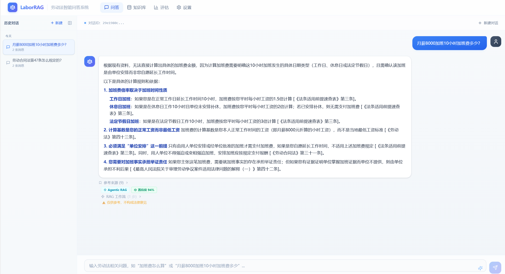
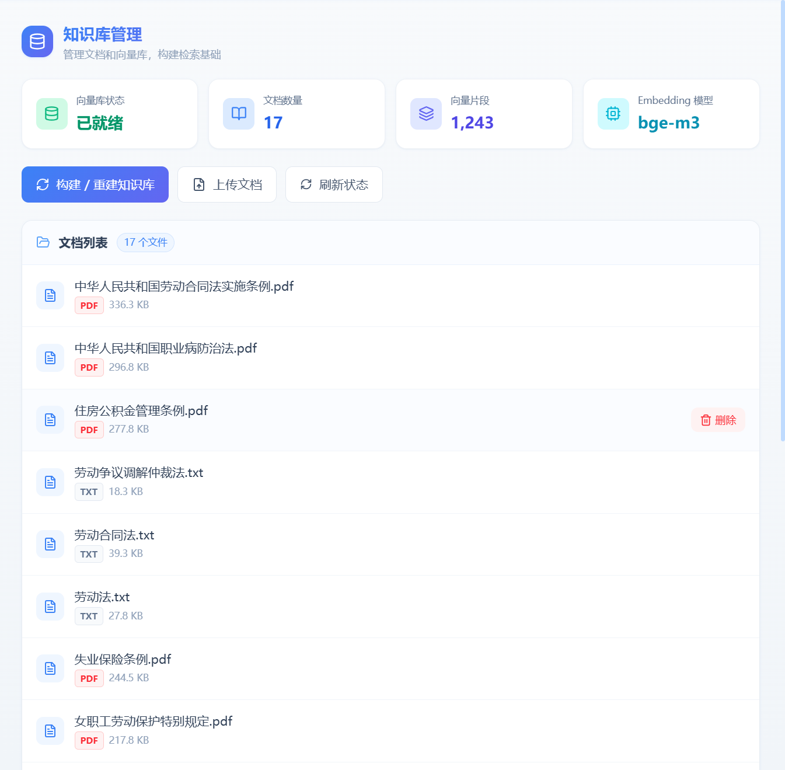
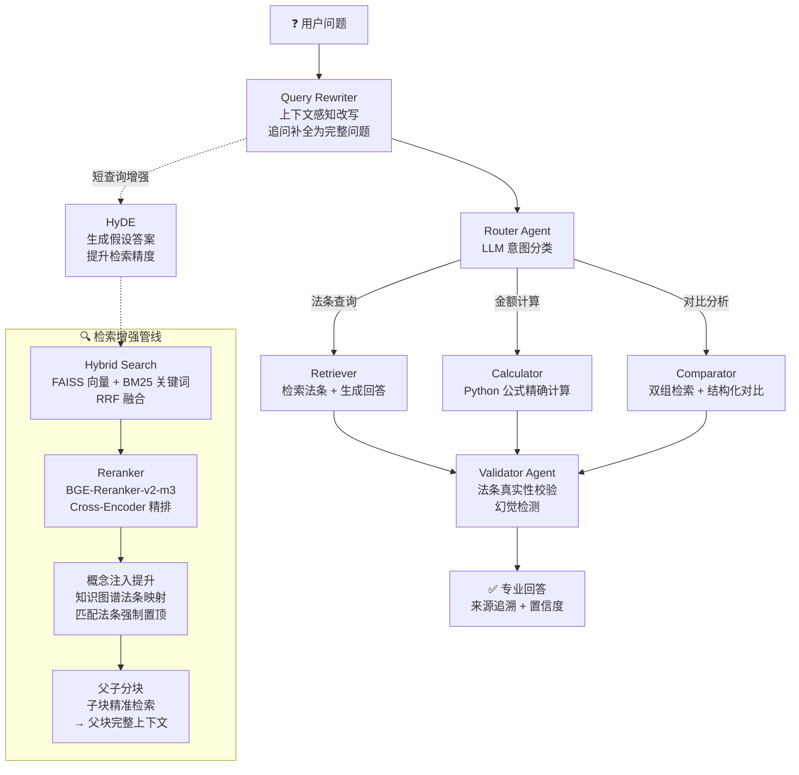

# LaborRAG · 劳动法智能问答系统

> **Agentic RAG × 多 Agent 协作 × 三元组评估**  
> 面向劳动法领域的智能问答系统——输入劳动法问题，自动检索法条、生成专业回答，支持金额计算、法条对比、多轮追问。

---

## 📸 系统截图

| 问答页 | 评估结果 | 知识库管理 |
|:---:|:---:|:---:|
|  |  |  |
| *智能问答 + 来源追溯 + Agent 工作流可视化* | *20 题三元组评估指标汇总* | *17 部法律文档 + 1243 chunks* |

---

## 🎯 核心亮点

- **检索精度 P@1**：20% → **90%**（概念注入提升策略：知识图谱法条映射 + 强制置顶）
- **幻觉率**：61% → **8%**（CRAG 自我纠错 + Validator 法条真实性验证 + 答案护栏）
- **工程化**：15 个 pytest 单测 + 结构化日志 + 全局异常处理 + pre-commit 安全钩子
- **评估体系**：三元组（RAGAS + 检索指标 P@1/P@3/P@5/R@5/MRR + 响应指标 ROUGE/BLEU/幻觉率/完整性）

---

## 🏗️ 系统架构



---

## 📊 核心评估指标（20 题 Full Set）

| 指标 | 得分 | 说明 |
|------|------|------|
| **精确率 P@1** | **90.0%** | 首位命中的法条准确率 |
| **召回率 R@5** | **92.5%** | 前 5 条中相关法条的召回率 |
| **忠实度 Faithfulness** | **92.0%** | 回答内容与检索资料的一致性 |
| **幻觉率 Hallucination** | **8.0%** | 回答中无依据内容的比例 |
| **完整性 Completeness** | **89.5%** | 回答对参考答案的覆盖程度 |

> 💡 **优化对比**：P@1 从 20% 提升至 90%（概念注入提升策略），幻觉率从 61% 降至 8%（CRAG + 验证护栏）。
> 评估使用 **Golden Set 标注数据**（20 题标准答案 + 相关法条标注），支持按问题类型和难度分维度统计。

---

## 🧠 技术选型与理由

| 层级 | 技术 | 用途 | 为什么选它 |
|------|------|------|-----------|
| LLM | 百炼 qwen3.7-max | 回答生成 | 中文法律文本理解强，API 兼容 OpenAI SDK |
| LLM（评估） | qwen3.5-plus | RAGAS 评估 | Plus 级别成本更低，评估任务 token 少 |
| Embedding | BAAI/bge-m3 | 文本向量化 | 中文语义 SOTA，本地 CPU 运行零 API 费用 |
| Reranker | BGE-Reranker-v2-m3 | Cross-Encoder 精排 | 与 BGE-M3 同系列一致性好，本地运行 |
| 向量库 | FAISS | 向量存储与检索 | 纯 C++ 零网络依赖，对比 Milvus/Weaviate 不需要 Docker |
| BM25 | jieba + rank_bm25 | 关键词检索 | jieba 中文分词成熟，与向量检索互补（语义 + 关键词） |
| Agent | LangGraph | 多 Agent 工作流 | StateGraph 天然支持条件分支，适合 Router→专业Agent→Validator 模式 |
| 评估 | RAGAS + 自研指标 | 三元组评估 | RAGAS 覆盖忠实度/上下文精度/召回；自研指标补检索 + 响应维度 |
| 后端 | FastAPI + Uvicorn | API 服务 | 异步原生支持，Pydantic 集成，启动即校验配置 |
| 前端 | React + TypeScript + TailwindCSS | 用户界面 | 组件化 + 类型安全 + 原子化样式 |

---

## 🔧 工程化实践

| 实践 | 实现 | 面试看点 |
|------|------|---------|
| **单元测试** | pytest 15 个用例，覆盖计算引擎、检索指标、法条切分 | `pyproject.toml` 配 pythonpath，`cd backend && pytest` 即跑 |
| **结构化日志** | `logging.config.dictConfig`，格式 `时间 \| 级别 \| 模块 \| 消息` | 替代裸 print；uvicorn.access 过滤 `/evaluation/status` 轮询噪音 |
| **配置管理** | Pydantic BaseSettings，`.env` 驱动，启动即校验 | 12 种配置项自动类型转换，跨字段 fallback（EVAL→LLM, RAGAS→EVAL） |
| **全局异常处理** | `@app.exception_handler(Exception)` 统一 500/422 JSON 格式 | `request_id`（uuid）中间件串联请求全链路排障 |
| **安全钩子** | `githooks/pre-commit`：拦截 `.env` 提交 + 扫描 `sk-` 密钥串 | `.gitignore` 防线 1，钩子防线 2（兜底 `git add -f` 和代码里粘 key） |
| **日志编码** | stdout/stderr reconfigure 为 UTF-8 + errors=replace | Windows GBK 控制台写 emoji 不崩 |

---

## 🐛 测试驱动的问题发现

编写单测过程中发现并修复了 2 个真实 bug，展示了「测试 → 发现 → 定位 → 修复 → 验证」的完整闭环：

### Bug 1：法条切分正则漏「零」

| 阶段 | 内容 |
|------|------|
| **症状** | test_text_splitter 用例「第一百零八条」匹配失败 |
| **根因** | `ARTICLE_PATTERN` 字符类 `[一二三四五六七八九十百千]` 缺少「零」，导致中文数字如「第一百零一条」无法匹配 |
| **影响** | 劳动法第 101-107 条被错误合并进第 100 条，这 7 条法条的检索质量受影响 |
| **修复** | 字符类补「零」：`[一二三四五六七八九十百零千\d]` |
| **验证** | 重建知识库，chunks 从 1236 → **1243（+7）**，正好对应受影响的 7 条法条 |

### Bug 2：检索指标空输入返回值不一致

| 阶段 | 内容 |
|------|------|
| **症状** | test_empty_inputs 用例触发 KeyError `'precision@1'` |
| **根因** | `compute_retrieval_metrics` 空输入返回 `precision@5`，非空返回 `precision@1`——同一函数两种 key 契约 |
| **修复** | 空输入对齐非空路径，统一返回 `precision@1` |
| **验证** | 15 个单测全绿（含空输入边界用例） |

---

## 📁 项目结构

```
LaborRAG/
├── backend/
│   ├── app/
│   │   ├── main.py                  # FastAPI 入口 + 模型预加载 + 中间件
│   │   ├── config.py                # Pydantic BaseSettings 配置管理
│   │   ├── core/
│   │   │   ├── rag_engine.py        # RAG 引擎（整合检索+生成）
│   │   │   ├── text_splitter.py     # 法条结构化切分器（按「第X条」切分）
│   │   │   ├── embeddings.py        # BGE-M3 Embedding 模型
│   │   │   ├── vectorstore.py       # FAISS 向量库管理
│   │   │   ├── document_loader.py   # 文档加载（PDF/DOCX/TXT/MD）
│   │   │   ├── conversation.py      # 对话历史持久化（JSON）
│   │   │   ├── logging_config.py    # 结构化日志配置（dictConfig）
│   │   │   ├── retriever/           # 检索层（vector/bm25/hybrid/reranked + 知识图谱 + 查询增强）
│   │   │   └── generator/           # 生成层（Agentic RAG 工作流 + 计算/对比/验证节点）
│   │   ├── evaluation/              # 三元组评估体系
│   │   │   ├── eval_dataset.py      # Golden Set 标注数据（20题双轨制）
│   │   │   ├── eval_runner.py       # 三阶段执行器
│   │   │   ├── eval_persistent.py   # 断点续评 + 任务生命周期管理
│   │   │   ├── retrieval_metrics.py # 检索指标（P@1/P@3/P@5/R@5/MRR/MAP）
│   │   │   └── response_metrics.py  # 响应指标（ROUGE-L/BLEU/幻觉率/完整性）
│   │   └── api/routes.py            # API 路由
│   ├── run.py                       # 后端启动入口
│   ├── requirements.txt             # Python 依赖
│   ├── pyproject.toml               # pytest 配置
│   └── tests/                       # 15 个单测（calculators/retrieval_metrics/text_splitter）
├── frontend/
│   ├── src/                         # React + TypeScript + TailwindCSS
│   │   ├── pages/                   # 四页面：问答/知识库/评估/设置
│   │   └── components/              # ChatWindow/ConversationSidebar/MessageBubble/InputBar
│   └── package.json
├── data/labor_laws/                 # 17 部劳动法文档
├── githooks/pre-commit              # Git 安全钩子（拦截 .env 和 sk- 密钥）
├── docs/screenshots/                # 截图（本地填充）
└── README.md
```

---

## 🚀 快速开始

### 环境要求
- Python 3.10+ · Node.js 18+ · Conda（推荐）

### 1. 后端配置

```bash
conda create -n RAG python=3.10
conda activate RAG
cd backend
pip install -r requirements.txt
cp .env.example .env          # 编辑 .env，填入百炼 API Key
```

### 2. 前端配置

```bash
cd frontend
npm install
```

### 3. 启动

```bash
# 终端 1 — 后端
conda activate RAG
python backend/run.py

# 终端 2 — 前端
python frontend/run.py
```

浏览器打开 `http://localhost:5173`

### 4. 运行测试

```bash
cd backend
pytest -v                     # 15 个用例，预期全绿
```

---

## 💬 系统功能详解

### 三种问题类型自动识别

| 问题类型 | 示例 | 处理方式 |
|---------|------|---------|
| **法条查询** | "加班工资怎么算？" "试用期最长多久？" | 检索法条 → LLM 基于资料生成回答 |
| **金额计算** | "月薪 8000 加班 10 小时加班费多少？" | 识别参数 → Python 公式精确计算 → 法条依据 |
| **对比分析** | "经济补偿金和赔偿金有什么区别？" | 双组检索 → 结构化对比表 |

### 关键能力

- **来源追溯**：每个回答附带参考法条来源、相关度分数
- **多轮对话**：支持追问，上下文感知查询改写自动补全
- **对话持久化**：前端 localStorage + 后端 JSON 双层持久化，重启不丢失
- **缺参引导**：计算类问题缺少参数时返回公式框架 + 法条依据
- **幻觉防护**：Validator 验证法条真实性 + 输出护栏禁止编造法条
- **超纲拒答**：非劳动法问题触发拒答，避免强行解释
- **人性化回答**：13 条风格规则（先结论 → 通俗解释 → 逐句标注来源 → 法条竞合处理）

### 检索与生成技术栈

| 能力 | 技术 | 作用 |
|------|------|------|
| 混合检索 | FAISS 向量 + BM25(jieba) + RRF 融合 | 语义 + 关键词双路互补 |
| 重排序 | BGE-Reranker-v2-m3 Cross-Encoder | Top-K 精排，提升排序质量 |
| 概念注入提升 | 知识图谱概念映射 + 强制置顶 | 规则匹配高置信度法条提升至首位（P@1 20%→90%） |
| 查询增强 | HyDE（短查询 ≤15 字触发）+ 上下文感知改写 | 生成假设答案提升检索精度 / 追问自动补全 |
| 自适应路由 | Adaptive RAG | 简单查询省 40%+ token，复杂查询走完整纠错链路 |
| 自我纠错 | CRAG | 检索评估 → HyDE → 生成 → 忠实度评估闭环 |
| 多 Agent 协作 | Router → Retriever/Calculator/Comparator → Validator | 意图分发 + 专业处理 + 质量把关 |
| 降级兜底 | 异常时自动降级到 simple 模式 | 保证系统可用性 |

---

## 📚 覆盖法律（17 部）

| 法律文件 | |
|---------|------|
| 《劳动法》《劳动合同法》《劳动合同法实施条例》《劳动争议调解仲裁法》《社会保险法》 | 核心劳动法律 |
| 《工伤保险条例》《职工带薪年休假条例》《女职工劳动保护特别规定》《最低工资规定》《工资支付暂行规定》 | 行政法规 |
| 《失业保险条例》《职业病防治法》《住房公积金管理条例》 | 社会保障 |
| 《最高人民法院司法解释（一）（二）》 | 审判规则 |
| 《职工非因工伤残或因病丧失劳动能力程度鉴定标准》《法条适用前提速查表》 | 鉴定标准与速查 |

---

## 📊 三元组评估体系

- **RAGAS 指标**：faithfulness / context_precision / context_recall
- **检索指标**：P@1 / P@3 / P@5 / R@5 / MRR / MAP（基于 relevant_articles 标注匹配）
- **响应指标**：ROUGE-L / BLEU / 幻觉率 / 完整性（LLM 评估）
- **双轨制**：Smoke Set（5 题快速验证）+ Full Set（20 题完整评估），Smoke ⊂ Full
- **分维度统计**：按 question_type + difficulty 分组
- **可观测面板**：检索质量 / 生成质量 / 业务指标三维度概览，Bad Case 快速定位
- **断点续评**：每题结果实时保存，崩溃/重启后可手动续评
- **任务管理**：创建 / 启动 / 继续 / 重评 / 停止 / 删除完整生命周期

---

## 🔄 版本演进

每版解决上一版的核心问题，逐步提升系统能力：

| 版本 | 核心问题 | 新增能力 |
|------|---------|---------|
| **V1** | 从 0 到 1 搭建 RAG 基础 | 向量检索 + LCEL 链式生成 + 知识库管理 |
| **V2** | 纯向量检索精度不足 | 混合检索 + 重排序 + 法条切分 + 三元组评估 |
| **V3** | 无纠错能力，检索错误直接传给 LLM | CRAG 自我纠错 + HyDE 增强 + 多轮对话 |
| **V4** | 无法处理计算/对比类问题 | 多 Agent 协作 + 上下文感知改写 + 人性化回答 |
| **V5** | P@1 仅 20%，概念注入被 reranker 淹没 | 概念注入提升 + 知识图谱增强 + 评估体系完善 + 幻觉率 61%→8% |

---

## 📡 API 接口

| 方法 | 端点 | 说明 |
|------|------|------|
| POST | `/api/v1/chat` | 智能问答（支持多轮对话） |
| GET | `/api/v1/knowledge-base/status` | 知识库状态 |
| POST | `/api/v1/knowledge-base/build` | 构建/重建知识库 |
| POST | `/api/v1/documents/upload` | 上传文档 |
| GET | `/api/v1/documents/list` | 文档列表 |
| DELETE | `/api/v1/documents/{filename}` | 删除文档 |
| POST | `/api/v1/evaluation/run` | 启动评估（后台异步） |
| GET | `/api/v1/evaluation/status` | 查询评估状态 |
| GET | `/api/v1/evaluation/report` | 获取评估报告 |
| POST/GET/DELETE | `/api/v1/evaluation/persistent/*` | 断点续评任务管理 |

---

## ⚠️ 注意事项

- FAISS 底层 C++ 不支持中文路径，向量库存储在 `RUNTIME_DATA_DIR`（默认 `D:/LaborRAG_data/`）
- BGE-M3 模型首次运行需下载约 2 GB，后续从本地缓存加载
- BGE-Reranker-v2-m3 首次运行需下载约 560 MB
- 国内环境建议设置 `HF_ENDPOINT=https://hf-mirror.com` 加速模型下载
- 评估并发度建议 2-4，过高可能触发 API 限流
- 本系统回答仅供参考，不构成法律意见
